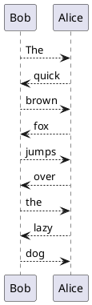

<!--
MIT License

Copyright (c) 2020, Friedt Professional Engineering Services, Inc

Permission is hereby granted, free of charge, to any person obtaining a copy
of this software and associated documentation files (the "Software"), to deal
in the Software without restriction, including without limitation the rights
to use, copy, modify, merge, publish, distribute, sublicense, and/or sell
copies of the Software, and to permit persons to whom the Software is
furnished to do so, subject to the following conditions:

The above copyright notice and this permission notice shall be included in
all copies or substantial portions of the Software.

THE SOFTWARE IS PROVIDED "AS IS", WITHOUT WARRANTY OF ANY KIND, EXPRESS OR
IMPLIED, INCLUDING BUT NOT LIMITED TO THE WARRANTIES OF MERCHANTABILITY,
FITNESS FOR A PARTICULAR PURPOSE AND NONINFRINGEMENT. IN NO EVENT SHALL THE
AUTHORS OR COPYRIGHT HOLDERS BE LIABLE FOR ANY CLAIM, DAMAGES OR OTHER
LIABILITY, WHETHER IN AN ACTION OF CONTRACT, TORT OR OTHERWISE, ARISING FROM,
OUT OF OR IN CONNECTION WITH THE SOFTWARE OR THE USE OR OTHER DEALINGS IN THE
SOFTWARE.
-->

# Overview

In this example, we are going to use the [Google Test Framework](https://github.com/google/googletest) to validate that a particular protocol is followed between two asynchronous threads of execution that are communicating over a reliable channel. Google Test Framework is an invaluable tool and the reader is encouraged to read [the](https://github.com/google/googletest/tree/master/googletest) [docs](https://github.com/google/googletest/tree/master/googlemock).

Normally when dealing with protocol specifications, we use [Sequence Diagrams](https://en.wikipedia.org/wiki/Sequence_diagram).So the example will be expressed both as a sequence diagram and as easy-to-understand code snippits.

Lastly, just to spice it up, we're going to test C code - not C++. [C is still the #1 language used in Embedded Systems](https://www.geeksforgeeks.org/top-10-best-embedded-systems-programming-languages/) and it also tends to be where a lot of mistakes happen, and hence, where proper testing is critical.

# Software Requirements
In this example, we assume the user is running [Ubuntu Bionic](https://releases.ubuntu.com/18.04/).

Perform the following tasks.

1. Export a variable that points to the desired directory
    ```console
    export WORKSPACE=${HOME}/workspace
    mkdir -p ${WORKSPACE}
    ```
1. Install common build utilities
    ```console
    sudo apt-get update
    sudo apt install -y build-essential cmake
    ```
1. Install Google Test Framework
    ```console
    cd ${WORKSPACE}
    git clone https://github.com/googletest/googletest.git
    cd googletest
    # install static libraries
    cmake -DCMAKE_CXX_FLAGS="-fPIC" .
    make -j`nproc --all` install
    # install shared libraries
    cmake -DCMAKE_CXX_FLAGS="-fPIC" -DBUILD_SHARED_LIBS=ON .
    make -j`nproc --all` install
    ```
1. Install `abseil-cpp`
    ```console
    cd ${WORKSPACE}
    git clone https://github.com/abseil/abseil-cpp.git
    cd abseil-cpp
    mkdir build
    cmake ..
    make -j`nproc --all`
    make -j`nproc --all` install
    ```
1. Clone and build this repository
    ```console
    cd ${WORKSPACE}
    git clone https://github.com/cfriedt/using-gmock-and-gtest-to-validate-a-protocol.git
    cd using-gmock-and-gtest-to-validate-a-protocol
    make -j`nproc --all`
    ```
The project should compile cleanly, but if not, please submit an [issue](https://github.com/cfriedt/using-gmock-and-gtest-to-validate-a-protocol/issues).

# Alice & Bob

A very common scenario where there are two independent threads of execution is the classic [Bob / Alice](https://en.wikipedia.org/wiki/Alice_and_Bob) (client / server) situation. In this case Bob is the client and Alice is the server.

Let's pretend that Alice & Bob have a job to perform cooperatively. That job is to work together to print out the phrase ***The quick brown fox jumps over the lazy dog***.

If we begin indexing the words at 0, and take 0 as an even number, then let's assign Bob even-numbered words, and Alice odd-numbered words. Bob, like most clients initiatest the conversation.

| Bob   | Alice |
|-------|-------|
| The   | quick |
| brown | fox   |
| jumps | over  |
| the   | lazy  |
| dog   |       |

Assume that Alice & Bob are connected over a reliable communication channel and that Bob is able to communicate with Alice using a buffered, r/w file descriptor. Assume also that Alice is able to communicate with Bob over another buffered, r/w file descriptor.

Alice waits for the word "The" from Bob. Only after that word is received. does Alice begin to send "quick" in response. Meanwhile, after sending "The", Bob awaits the word "quick" and so on.

The job is done when Alice receives the word "dog".

It's quite straight forward to express this conversation in UML as well, using a sequence diagram. Using [PlantUML](https://plantuml.com), we can describe that sequence diagram as shown below, which results in the subsequently displayed sequence diagram.




## Communication API

Lastly, in this example, Bob and Alice are restricted to using the standard [POSIX](https://en.wikipedia.org/wiki/POSIX) API calls [read(2)](https://pubs.opengroup.org/onlinepubs/009695399/functions/read.html) and [write(2)](https://pubs.opengroup.org/onlinepubs/009695399/functions/write.html) to communicate with each other. Nobody ever said these threads were in the same address space or on the same device. However, an integer file descriptor should be sufficient to describe their communication channel.

We will use [dependency injection](en.wikipedia.org/wiki/Dependency_injection) to fake the `read(2)` and `write(2)` system calls in our tests (that's just a fancy way of saying we will link to our own before the normal ones are linked via the system libc).

While abstraction layers on embedded systems can and do very tremendously, the same pattern can be followed for more or less any transport-specific read and write calls that are "free functions" (non-member functions in the global namespace). The transport could be an RTOS-specific message-passing API, it could be writing to mapped memory, bit-banging a GPIO pin, or writing to a UART.

## Demonstration

There is a binary that is built by default called `demo`. We use the [socketpair(2)](https://pubs.opengroup.org/onlinepubs/9699919799/functions/socketpair.html) system call to establish a connection for Alice & Bob to communicate. Since sockets are simply represented as integer file descriptors, and work as expected with `read(2)` and `write(2)`, the communication API constraints above are satisfied.

When `./demo` is run, then the following output should be observed. It can be run 1M times in a row and it will still produce the same output.

```console
$ for ((i=0; i < 1000000; i++)); do ./demo; done
The quick brown fox jumps over the lazy dog 
The quick brown fox jumps over the lazy dog 
...
```

# Test Descriptions

There are 4 tests that are run
* `Bob.TheQuickBrownFox_WillRepeatedly` demonstrates using `EXPECT_CALL()` and `WillRepeatedly()`
  * This avenue should be used if the code that handles each messages is identical
  * A typical use case is when messages are handled using a [Mealy-type](https://en.wikipedia.org/wiki/Mealy_machine) [Finite State Machine (FSM)](https://en.wikipedia.org/wiki/Finite-state_machine).
* `Bob.TheQuickBrownFox_WillOnce` demonstrates using `EXPECT_CALL()` and several chained calls to `WillOnce()`
  * This will execute overriden methods in the sequence they appear in the chain
  * Each call to `WillOnce()` can `Invoke()` a separate function (we use [lambda expressions](https://en.cppreference.com/w/cpp/language/lambda) in the example)
* `Bob.TheQuickBrownFox_timeout` demonstrates a case that fails to meet the specifications of the protocol and fails (which causes a timeout during testing)
  * The timeout is handled gracefully using `absl::Notification`
* `Bob.TheQuickBrownFox_defaultImplTimeout` demonstrates using the default `MOCK_METHOD()` implementation (which, too, causes a timeout during testing)
  * The timeout is handled gracefully using `absl::Notification`

## Disclaimer

For real-world protocols that have any amount of complexity. Typically there would be substantially more test points to check in terms of options, control-flow, asynchronous read / write, etc.

This is an obviously contrived example with enough code to demonstrate the concept, to check the "happy path", and to protect against timeouts.

## A Repeatable Integration Test

This is the step that should be run in Continuous Integration.

In order to run the test suite, simply run `make check` and observe the following output:

```console
$ make check
if [ -z "bob-test" ]; then \
        exit 0; \
fi; \
for t in bob-test; do \
        ./$t; \
done
Running main() from gmock_main.cc
[==========] Running 4 tests from 1 test suite.
[----------] Global test environment set-up.
[----------] 4 tests from Bob
[ RUN      ] Bob.TheQuickBrownFox_WillRepeatedly
The quick brown fox jumps over the lazy dog 
[       OK ] Bob.TheQuickBrownFox_WillRepeatedly (6 ms)
[ RUN      ] Bob.TheQuickBrownFox_WillOnce
The quick brown fox jumps over the lazy dog 
[       OK ] Bob.TheQuickBrownFox_WillOnce (1 ms)
[ RUN      ] Bob.TheQuickBrownFox_timeout
A timeout occurred
[       OK ] Bob.TheQuickBrownFox_timeout (1000 ms)
[ RUN      ] Bob.TheQuickBrownFox_defaultImplTimeout

GMOCK WARNING:
Uninteresting mock function call - returning default value.
    Function call: write(42, 0x4f0420, 3)
          Returns: 0
NOTE: You can safely ignore the above warning unless this call should not happen.  Do not suppress it by blindly adding an EXPECT_CALL() if you don't mean to enforce the call.  See https://github.com/google/googletest/blob/master/googlemock/docs/cook_book.md#knowing-when-to-expect for details.
A timeout occurred
[       OK ] Bob.TheQuickBrownFox_defaultImplTimeout (1001 ms)
[----------] 4 tests from Bob (2010 ms total)

[----------] Global test environment tear-down
[==========] 4 tests from 1 test suite ran. (2010 ms total)
[  PASSED  ] 4 tests.
```

# Notes on Testing

[Unit testing](https://en.wikipedia.org/wiki/Unit_testing) is a practice often followed in embedded software engineering but [integration testing](https://en.wikipedia.org/wiki/Integration_testing) is less commonly practised. In particular, it's less commonly practised when there are multiple threads of execution. Nobody is denying that asynchronous testing can be very hard.

When embedded systems are thrown into that mix, many developers just give up and run tests manually on hardware. Once. On their desk. A year ago. Or whenever a [regression](https://en.wikipedia.org/wiki/Software_regression) happens. However, integration tests really need to be run in [Continuous Integration](https://en.wikipedia.org/wiki/Continuous_integration) for developers to prevent regressions from occuring in the first place and also to reap the many other benefits.

Beyond regressions, it's exremely easy for humans to miss subtle software errors that are really only machine-detectable or only exist in some corner cases. So even though a product might appear to be functioning well to the naked eye, and developers might have the best of intentions, it is quite common to introduce bugs when corners are cut on automated testing. Make no mistake - human attended testing is no substitute for automated tests when it comes to software and hardware.

It should go without saying, but it's also much faster for a multi-core, multi-GHz server to run these tests than it is for a person to do so. Proper integration testing means a small up-front investment, but it pays dividends in the long-run compared to the cost of manual testing (or worse yet, fixing a bug in an already shipped product).

## Write Testable Code

The astute reader will likely take notice that we have compiled and linked against ***unmodified*** C code that would normally be running on our target system.
Indeed, by separating the business logic of the application from the hardware it runs on, it is possible to validate the behaviour of the code when it integrates with other parts of the system.

This can be achieved by
* isolating all inputs & outputs of the [Device Under Test (DUT)](https://en.wikipedia.org/wiki/Device_under_test)
* controlling execution and initial state via reset

To achieve the items above, only a few rules of thumb need to be adhered to:
* Code should be written portably (use standard types, do not assume a specific word-size)
* Use standard APIs (if a standard API is not available, a conventional API is the next best thing)
* Target- and hardware-specific functions and memory should be properly abstracted
* Global and static variables should be declared such that they may be reset to a known state
* Always check return values and do not cut corners

# Conclusion

We hope that this article has helped to demystify some of the nuances of protocol testing.

Thanks for reading, and happy testing!

___

Copyright (c) 2020, Friedt Professional Engineering Services, Inc
